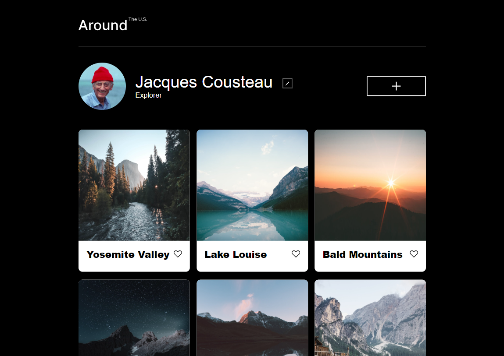

# Project 3: Around The U.S.

### Overview

- Intro
- Technologies & Techniques Used
- Images or Screenshots
- Github & Video Walkthrough Link

**Intro**

This project is an individual photo sharing landing page coded to make sure it's elements are displayed nicely on various screen sizes. It contains a simple header, profile, photo cards, and footer. It has the structure {i.e. buttons} to be able to edit the profile and add other information when built out and connected to other pages and codes. For now, it has a responsive layout that utilizes flexbox, grids, and media queries to keep the aesthetic clean.

**Technologies & Techniques Used**

This project was designed in Figma and photos, sizes, and grahic elements were all drawn from there. The code was written in VS Code. All photos have been optimized for faster loading times. Media queries have been written for responsive transitions around widths 750px, 620px, and 480px with a min-width of 320px.

**Images or Screenshots**

Here's the design at it's designed width of 1280px:

**Github & Video Walkthrough Link**

You can find the project's original Github [here](https://github.com/tripleten-com/se_project_aroundtheus)
My short video walkthrough of the project can be found [here](https://drive.google.com/file/d/18dOw6zqJgJcEtu1HhnrUFRoM7ClVbFVr/view?usp=sharing)
